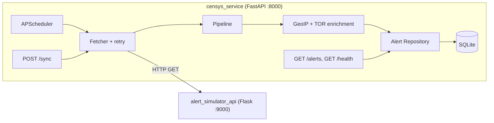

# Censys Alert Ingestion Service

A Python service that periodically fetches alerts from an upstream SIEM aggregator, enriches them with GeoIP and TOR classification data, normalizes them into a local database, and exposes a REST API for downstream consumers.

---

## Quick Start

```bash
# Copy environment config (defaults work out of the box)
cp .env.example .env

# Build and start both services
docker compose up --build
```

The Censys service is available at **http://localhost:8000**

The Mock Alert Simulator upstream API is available at **http://localhost:9000**

Auto-generated API docs (Swagger UI): **http://localhost:8000/docs**

> **Tip — `POST /sync`:**
> To trigger a manual sync, either use **Swagger UI** (`/docs` → `POST /sync` → Try it out → Execute)
> or run:
>
> ```bash
> curl -X POST http://localhost:8000/sync
> ```

---

## Requirements Checklist

| #   | Requirement                                    | Implementation                                                                                                                                                                           |
| --- | ---------------------------------------------- | ---------------------------------------------------------------------------------------------------------------------------------------------------------------------------------------- |
| 1   | Periodically fetch alerts from upstream API    | [`scheduler.py`](service/ingestion/scheduler.py) — APScheduler fires every `SYNC_INTERVAL_SECONDS` (default 60s, configurable)                                                           |
| 2   | Resilient to upstream failures                 | [`fetcher.py`](service/ingestion/fetcher.py) — tenacity retry with exponential backoff + jitter, up to 3 attempts; 5xx retried, 4xx not                                                  |
| 3   | Simulate upstream failures                     | [`alert_simulator_server.py`](alert_simulator_api/alert_simulator_server.py) — `MOCK_FAILURE_RATE` env var (default 20%) returns random 500s                                             |
| 4   | Enrich with two attributes                     | [`geo_ip.py`](service/enrichment/geo_ip.py) adds randomized public IP; [`tor_classifier.py`](service/enrichment/tor_classifier.py) classifies as `tor_exit_node` or `clean`              |
| 5   | Normalize and store in a database              | [`alert_repository.py`](service/storage/alert_repository.py) — SQLite, upsert by `(source, created_at)` dedup key; choice explained in [Architecture Decisions](#architecture-decisions) |
| 6   | `GET /alerts` with optional filters            | [`routes.py`](service/api/routes.py) — filters: `severity`, `source`, `enrichment_type`, `since`; pagination: `limit`, `offset`                                                          |
| 7   | `POST /sync` — immediate sync, returns quickly | [`routes.py`](service/api/routes.py) — returns `202 Accepted` immediately, sync runs in background; `409` if already running                                                             |
| 8   | `GET /health` with status/db/sync details      | [`routes.py`](service/api/routes.py) — returns `ok`/`degraded`/`down`, db connectivity, last sync time, last error                                                                       |
| 9   | On startup: resume from last fetch time        | [`server.py`](service/server.py) + [`pipeline.py`](service/ingestion/pipeline.py) — reads `last_fetched_at` from `sync_state` table; falls back to `DEFAULT_LOOKBACK_HOURS` on first run |
| 10  | Configurable sync interval                     | `SYNC_INTERVAL_SECONDS` env var — see [Configuration](#configuration)                                                                                                                    |
| 11  | Runs out of the box with Docker Compose        | [`docker-compose.yml`](docker-compose.yml) — `docker compose up --build`, no other setup required                                                                                        |
| 12  | Testing instructions                           | Automated: `pytest` with 100% coverage on enrichment module; manual: curl examples in [API Reference](#api-reference)                                                                    |

---

## Architecture



---

## Architecture Decisions

**Why SQLite?**
Zero operational overhead — no separate container or process. The storage layer is fully abstracted behind `alert_repository.py`, so migrating to PostgreSQL for a multi-instance production deployment is a connection string change, not an architectural one.

**Why not call the upstream from `/health`?**
Calling the upstream on every health check would generate unnecessary traffic and make our health status depend on upstream availability — but we want `degraded` to mean "upstream had issues during the last sync", not "upstream is unreachable right now". The last sync status persisted in the DB is a more reliable signal.

**Why `asyncio.Lock` for sync concurrency?**
The scheduler and `POST /sync` can both trigger a sync. Without a lock, overlapping syncs would fetch the same window twice. In a single-process service, `asyncio.Lock` is sufficient. In a multi-instance deployment this would need a distributed lock (e.g. Redis `SETNX`).

**Why a single-row `sync_state` table?**
The `sync_state` table stores exactly one row, enforced by `CHECK (id = 1)`. It acts as a persistent checkpoint — `last_fetched_at` tells the service where to resume after a restart, and `last_sync_status`/`last_error` are what `/health` reads. On every sync completion the row is updated in-place (`UPDATE`), never inserted again. This is simpler than a sync history log and sufficient for the use case.

**Why `202 Accepted` for `POST /sync`?**
The sync runs in the background — the response returns immediately before the sync completes. `200 OK` would imply the work is done, which it isn't. `202 Accepted` is the correct HTTP semantics for "request received, processing asynchronously".

**Why retry 5xx but not 4xx?**
A 5xx means the upstream had a server-side failure — retrying makes sense because the next attempt might succeed. A 4xx means we sent a bad request — retrying the exact same request will always get the same error, so it's pointless. Retrying 4xx would also mask bugs in our own request construction.

**Why upsert instead of insert for alerts?**
The `since` parameter uses the last successful fetch time, which can overlap with alerts already stored (e.g. after a partial failure). Upserting on `(source, created_at)` means duplicate alerts from the upstream are silently ignored rather than causing errors or storing duplicates. This makes ingestion idempotent — running the same sync twice produces the same result.

**Why a plugin list for enrichment instead of hardcoded calls?**
`_PLUGINS = [GeoIPPlugin(), TORClassifierPlugin()]` makes it trivial to add, remove, or reorder enrichment steps without touching pipeline logic. Each plugin only sees and modifies the alert dict — they're completely independent. This is the Strategy pattern: the pipeline doesn't know what enrichments exist, it just runs whatever is registered.

---

## API Reference

### `GET /alerts`

Returns normalized, enriched alerts from the local database.

| Parameter         | Type    | Description                                   |
| ----------------- | ------- | --------------------------------------------- |
| `severity`        | enum    | Filter: `low`, `medium`, `high`, `critical`   |
| `source`          | string  | Filter by source system (e.g., `splunk-prod`) |
| `enrichment_type` | enum    | Filter: `tor_exit_node`, `clean`              |
| `since`           | ISO8601 | Alerts created after this timestamp           |
| `limit`           | int     | Max results (default 100, max 500)            |
| `offset`          | int     | Pagination offset                             |

```bash
curl "http://localhost:8000/alerts?severity=critical&limit=10"
curl "http://localhost:8000/alerts?enrichment_type=tor_exit_node"
```

### `POST /sync`

Triggers an immediate fetch from the upstream API.

- Returns `202 Accepted` — sync runs in background, response is immediate
- Returns `409 Conflict` — if a sync is already in progress

```bash
curl -X POST http://localhost:8000/sync
```

### `GET /health`

Lightweight health check. Does **not** call the upstream API (see Architecture Decisions).

```bash
curl http://localhost:8000/health
```

Response:

```json
{
  "status": "ok",
  "db_connected": true,
  "last_successful_sync": "2026-02-22T10:00:00Z",
  "last_sync_status": "success",
  "last_error": null,
  "sync_interval_seconds": 60,
  "upstream_url": "http://alert_simulator_api:9000"
}
```

Status values:

- `ok` — DB reachable, last sync succeeded
- `degraded` — DB reachable but last sync failed (upstream issue, we're still serving stored alerts)
- `down` — DB not reachable (our service is broken)

---

## Configuration

All settings are environment variables. Defaults work for local development.

| Variable                 | Default                           | Description                                |
| ------------------------ | --------------------------------- | ------------------------------------------ |
| `UPSTREAM_URL`           | `http://alert_simulator_api:9000` | Upstream alerts API base URL               |
| `SYNC_INTERVAL_SECONDS`  | `60`                              | How often to poll the upstream             |
| `DB_PATH`                | `/data/alerts.db`                 | SQLite database file path                  |
| `LOG_LEVEL`              | `INFO`                            | Logging level                              |
| `DEFAULT_LOOKBACK_HOURS` | `24`                              | Lookback window on first startup           |
| `MOCK_FAILURE_RATE`      | `0.20`                            | Fraction of mock API calls that return 500 |

---

## Project Structure

```
censys-proj/
├── alert_simulator_api/     # Flask mock upstream Alerts API
│   ├── alert_simulator_server.py
│   └── Dockerfile
│
├── service/
│   ├── server.py           # FastAPI entry point + lifespan startup
│   ├── config.py           # Environment variable settings
│   ├── models.py           # Pydantic schemas
│   ├── api/routes.py       # HTTP endpoints
│   ├── ingestion/
│   │   ├── fetcher.py      # httpx + tenacity retry
│   │   ├── pipeline.py     # fetch → enrich → store orchestration
│   │   └── scheduler.py    # APScheduler periodic job
│   ├── enrichment/
│   │   ├── base.py         # Abstract plugin interface
│   │   ├── geo_ip.py       # GeoIP plugin
│   │   └── tor_classifier.py  # TOR exit node plugin
│   └── storage/
│       ├── database.py          # SQLite init, connection
│       ├── alert_queries.py     # Raw SQL only
│       └── alert_repository.py # Orchestration: filters, model mapping
│
├── tests/
│   └── test_enrichment.py
│
├── .github/workflows/
│   ├── lint.yml            # black, isort, pylint
│   ├── test.yml            # pytest + coverage
│   └── security.yml        # Snyk + OWASP ZAP
│
├── docker-compose.yml
├── pyproject.toml
└── .env.example
```

---

## CI/CD Pipeline

Three GitHub Actions workflows run on every push and pull request:

| Workflow       | Trigger       | Checks                                                     |
| -------------- | ------------- | ---------------------------------------------------------- |
| `lint.yml`     | Every push/PR | `black --check`, `isort --check`, `flake8` (separate jobs) |
| `test.yml`     | Every push/PR | `pytest` with 100% coverage on enrichment module           |
| `security.yml` | Every push    | Snyk dependency scan + OWASP ZAP DAST scan                 |

**Note:** The `SNYK_TOKEN` secret must be added to the GitHub repository secrets for the Snyk scan to run.
